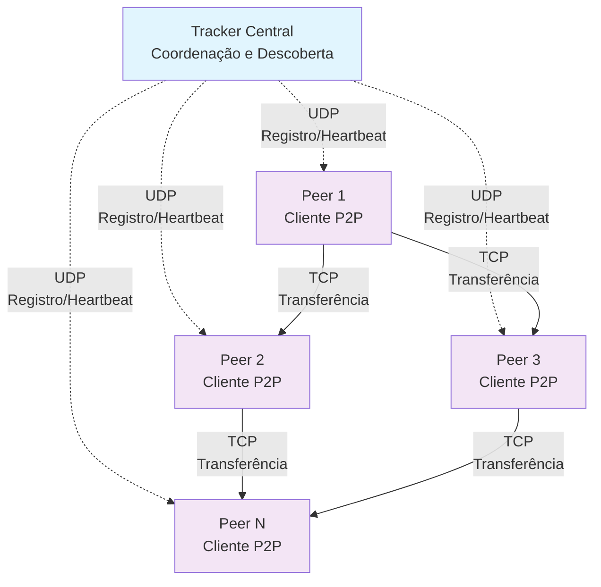
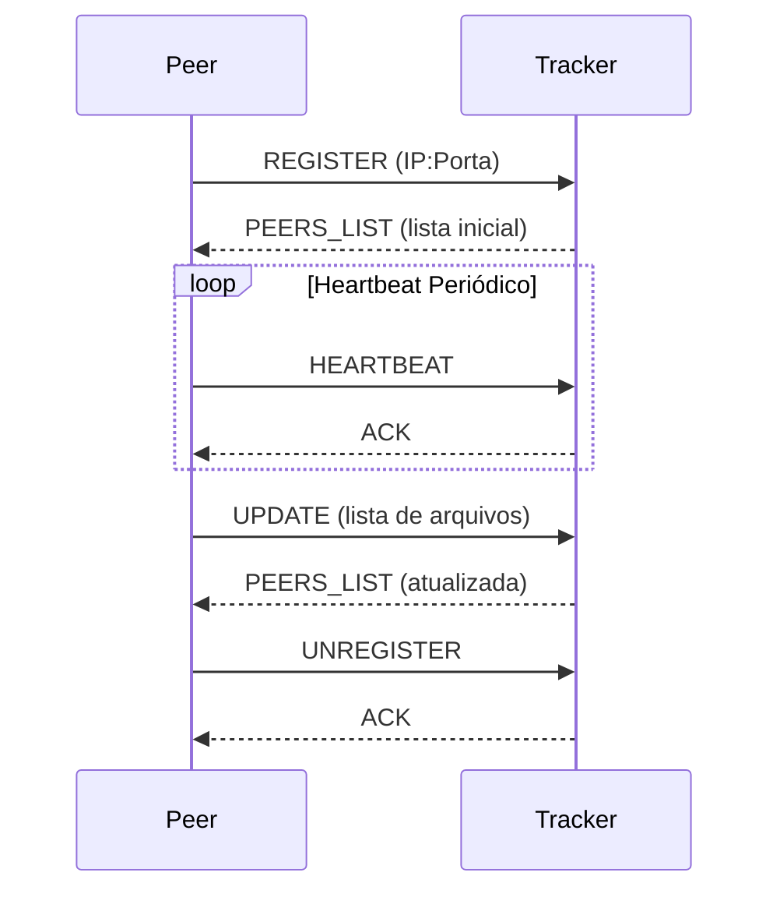
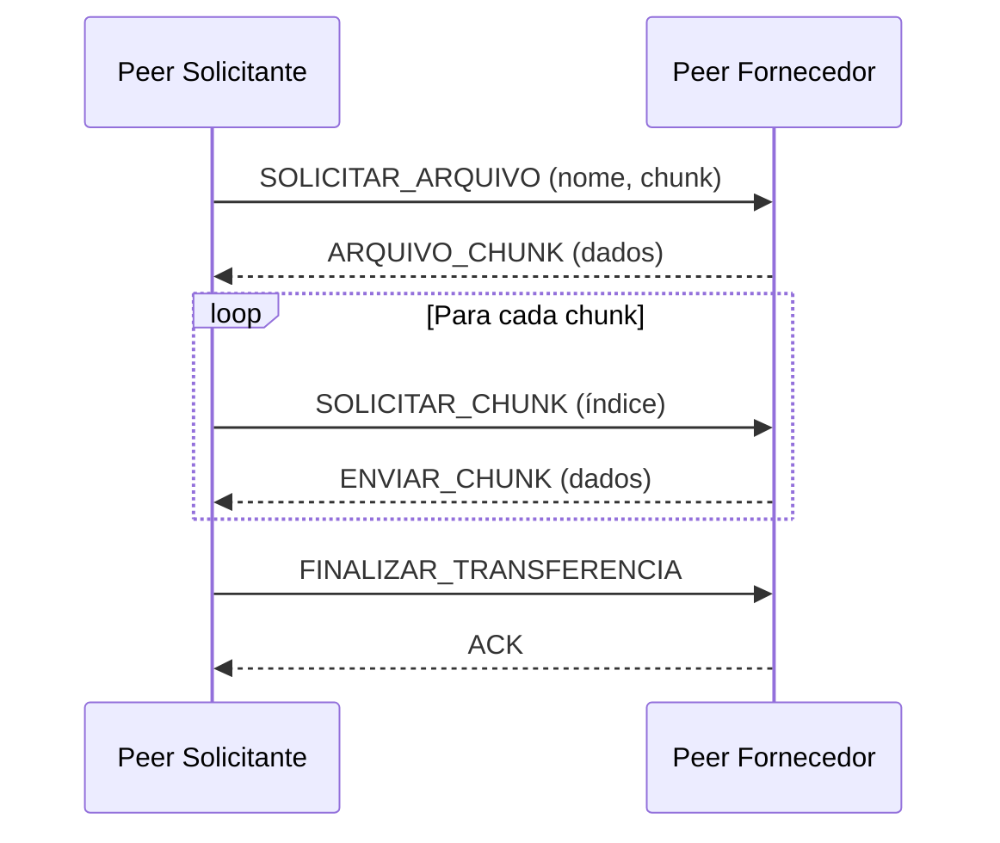

# 🌐 Sistema P2P de Compartilhamento de Arquivos

Um sistema completo de compartilhamento de arquivos peer-to-peer (P2P) com tracker centralizado, implementado em Java. O sistema permite que múltiplos peers compartilhem arquivos de forma distribuída e eficiente.

## 📋 Índice

- [Visão Geral](#-visão-geral)
- [Arquitetura](#-arquitetura)
- [Funcionalidades](#-funcionalidades)
- [Pré-requisitos](#-pré-requisitos)
- [Instalação](#-instalação)
- [Como Usar](#-como-usar)
- [Protocolos de Comunicação](#-protocolos-de-comunicação)
- [Estrutura do Projeto](#-estrutura-do-projeto)

## 🎯 Visão Geral

Este projeto implementa uma rede P2P híbrida onde um **tracker central** coordena a descoberta de peers, mas a transferência de arquivos ocorre diretamente entre os peers. O sistema é projetado para ser eficiente, escalável e robusto.

### Principais Características

- **Descoberta automática de peers** através do tracker central
- **Transferência direta** de arquivos entre peers
- **Monitoramento em tempo real** de arquivos compartilhados
- **Sistema de chunks** para transferência eficiente de arquivos grandes
- **Detecção automática** de peers inativos
- **Interface de linha de comando** intuitiva

## 🏗️ Arquitetura



## ✨ Funcionalidades

### 🛰️ Tracker Central
- ✅ **Registro dinâmico** de peers na rede
- ✅ **Atualização em tempo real** da lista de arquivos disponíveis
- ✅ **Remoção automática** de peers inativos (timeout)
- ✅ **Distribuição da lista** de peers ativos
- ✅ **Comandos suportados**: `REGISTER`, `UPDATE`, `UNREGISTER`, `HEARTBEAT`

### 💻 Peer (Cliente P2P)
- ✅ **Registro automático** no tracker ao iniciar
- ✅ **Monitoramento contínuo** da pasta compartilhada
- ✅ **Interface de comandos** interativa e intuitiva
- ✅ **Download paralelo** de arquivos de múltiplos peers
- ✅ **Sistema de chunks** para arquivos grandes
- ✅ **Heartbeat periódico** para manter conexão ativa
- ✅ **Comunicação TCP** otimizada para transferências

## 🔧 Pré-requisitos

- **Java JDK 24.0.1** ou superior
- **Sistema operacional**: Windows, Linux ou macOS
- **Rede**: Conectividade UDP e TCP
- **Portas**: Certifique-se de que as portas não estejam bloqueadas por firewall

## 📦 Instalação

### 1. Clone o repositório
```bash
git clone https://github.com/seu-usuario/P2P-em-Java.git
cd "P2P em Java"
```

### 2. Compile o projeto

**Para o Tracker:**
```bash
cd Tracker/src
javac -d ../../out *.java
```

**Para o Peer:**
```bash
cd Peer/src  
javac -d ../../out *.java
```

### 3. Execute o tracker
```bash
cd out
java Tracker
```

### 4. Execute os peers (em terminais separados)
```bash
cd out
java Peer
```

## 🚀 Como Usar

### Iniciando o Sistema

1. **Inicie o Tracker** primeiro:
   ```bash
   cd out
   java Tracker
   ```
   O tracker ficará escutando na porta padrão

2. **Inicie os Peers** (em terminais separados):
   ```bash
   cd out
   java Peer
   ```
   Cada peer se registrará automaticamente no tracker

### Comandos Disponíveis no Peer

| Comando | Descrição | Exemplo |
|---------|-----------|---------|
| `list` | Lista arquivos disponíveis na rede | `list` |
| `download <arquivo>` | Baixa um arquivo da rede | `download exemplo.txt` |
| `status` | Mostra status do peer | `status` |
| `peers` | Lista peers conectados | `peers` |
| `exit` | Sai do programa | `exit` |

### Exemplo de Uso Prático

```bash
# Terminal 1 - Tracker
$ cd out
$ java Tracker
[INFO] Tracker iniciado

# Terminal 2 - Peer 1
$ cd out  
$ java Peer
[INFO] Peer registrado com sucesso
[INFO] Pasta compartilhada: ./shared
> list
Arquivo1.txt (Peer: 192.168.1.100:9001)
Arquivo2.pdf (Peer: 192.168.1.101:9002)

# Terminal 3 - Peer 2  
$ cd out
$ java Peer
[INFO] Peer registrado com sucesso
> download Arquivo1.txt
[INFO] Baixando de 192.168.1.100:9001...
[INFO] Download concluído: Arquivo1.txt
```

## 📡 Protocolos de Comunicação

### Comunicação Peer ↔ Tracker (UDP)



### Transferência Peer ↔ Peer (TCP)



## 📁 Estrutura do Projeto

```
P2P em Java/
├── Peer/
│   ├── src/
│   │   ├── CommandInterface.java     # Interface de comandos do peer
│   │   ├── DownloadManager.java      # Gerenciamento de downloads
│   │   ├── FileManager.java          # Gerenciamento de arquivos
│   │   ├── Peer.java                 # Cliente peer principal
│   │   ├── TCPClient.java            # Cliente TCP para transferências
│   │   ├── TCPServer.java            # Servidor TCP do peer
│   │   └── TrackerClient.java        # Cliente para comunicação com tracker
│   └── Peer.iml                      # Arquivo de configuração IntelliJ
├── Tracker/
│   ├── src/
│   │   ├── MethodsManager.java       # Gerenciamento de métodos do tracker
│   │   └── Tracker.java              # Servidor tracker principal
│   └── Tracker.iml                   # Arquivo de configuração IntelliJ
├── .idea/                            # Configurações do IntelliJ IDEA
├── out/                              # Arquivos compilados
└── README.md                         # Este arquivo
```

