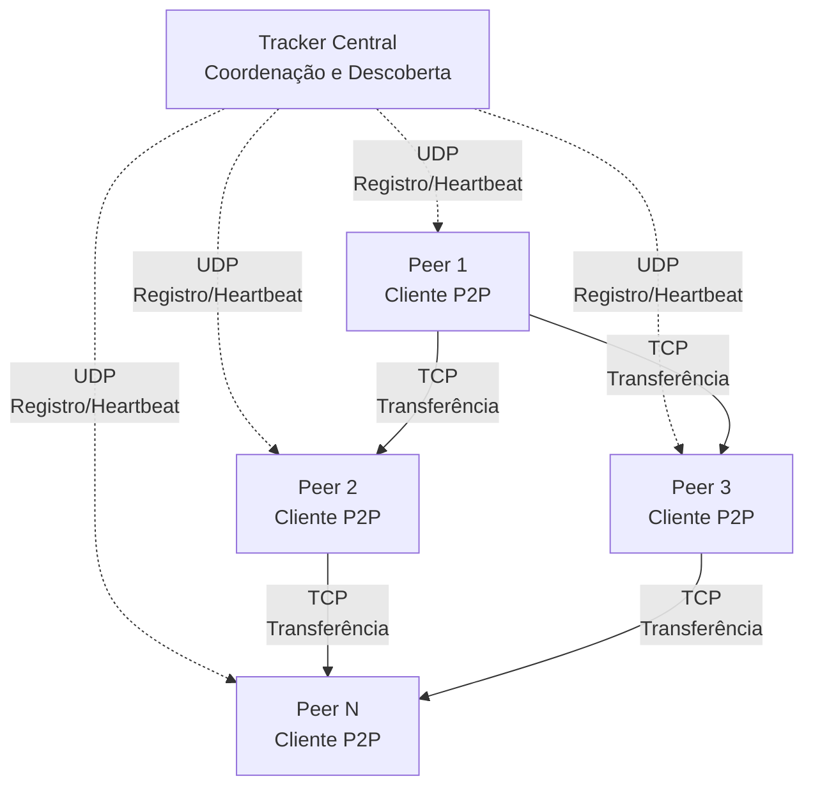
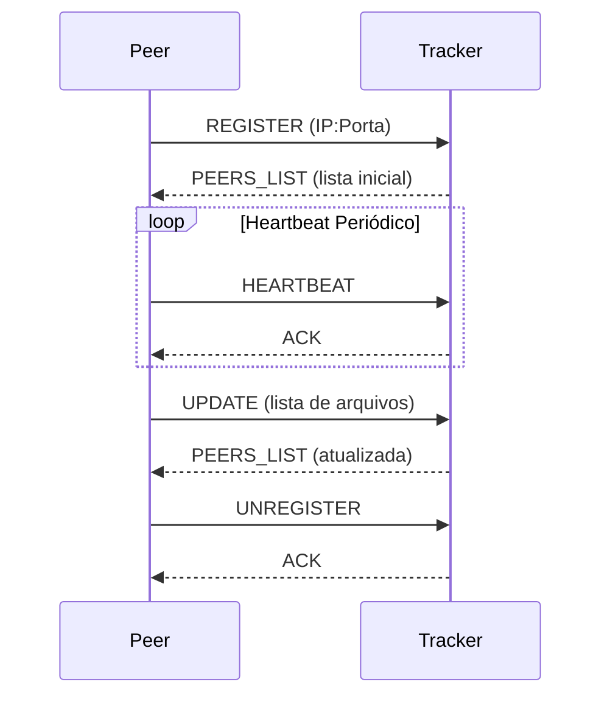
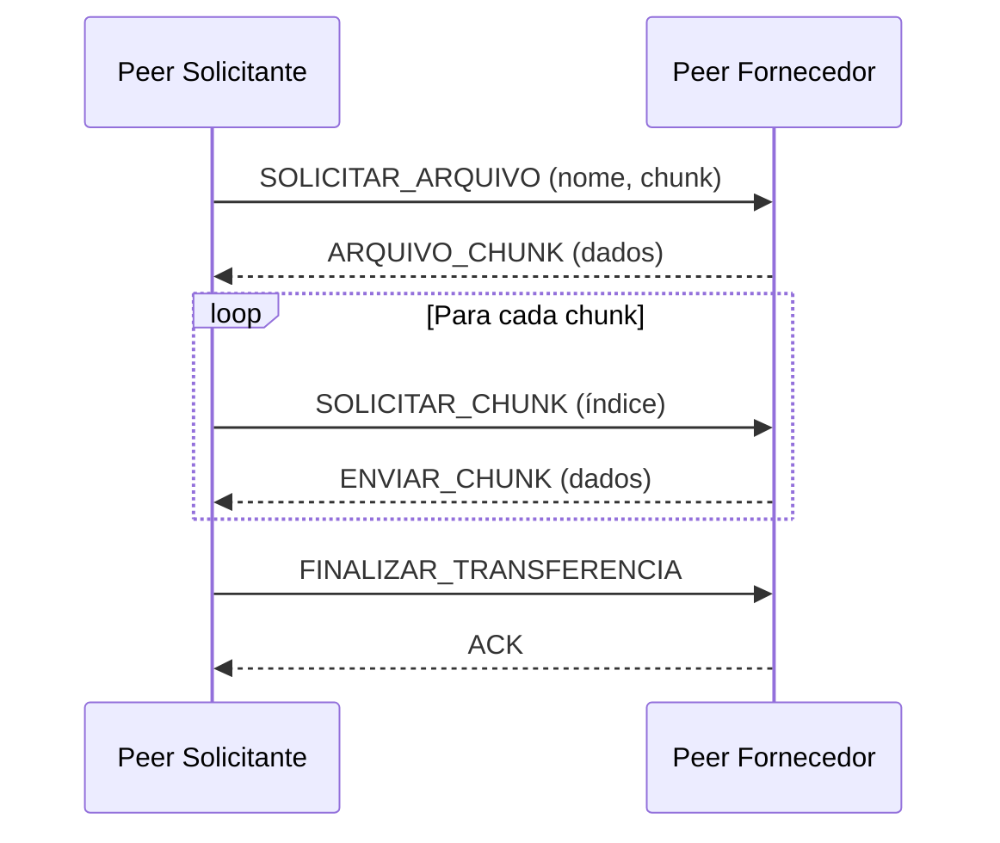

# 🌐 Sistema P2P de Compartilhamento de Arquivos

Um sistema completo de compartilhamento de arquivos peer-to-peer (P2P) com tracker centralizado, implementado em Java. O sistema permite que múltiplos peers compartilhem arquivos de forma distribuída e eficiente.

## 📋 Índice

- [Visão Geral](#-visão-geral)
- [Funcionalidades](#-funcionalidades)
- [Protocolos de Comunicação](#-protocolos-de-comunicação)

## 🎯 Visão Geral

Este projeto implementa uma rede P2P híbrida onde um **tracker central** coordena a descoberta de peers, mas a transferência de arquivos ocorre diretamente entre os peers. O sistema é projetado para ser eficiente, escalável e robusto.

### Principais Características

- **Descoberta automática de peers** através do tracker central
- **Transferência direta** de arquivos entre peers
- **Monitoramento em tempo real** de arquivos compartilhados
- **Sistema de chunks** para transferência eficiente de arquivos grandes
- **Detecção automática** de peers inativos
- **Interface de linha de comando** intuitiva

## 🏗️ Arquitetura

## ✨ Funcionalidades

### 🛰️ Tracker Central
- ✅ **Registro dinâmico** de peers na rede
- ✅ **Atualização em tempo real** da lista de arquivos disponíveis
- ✅ **Remoção automática** de peers inativos (timeout)
- ✅ **Distribuição da lista** de peers ativos
- ✅ **Comandos suportados**: `REGISTER`, `UPDATE`, `UNREGISTER`, `HEARTBEAT`

### 💻 Peer (Cliente P2P)
- ✅ **Registro automático** no tracker ao iniciar
- ✅ **Monitoramento contínuo** da pasta compartilhada
- ✅ **Interface de comandos** interativa e intuitiva
- ✅ **Download paralelo** de arquivos de múltiplos peers
- ✅ **Sistema de chunks** para arquivos grandes
- ✅ **Heartbeat periódico** para manter conexão ativa
- ✅ **Comunicação TCP** otimizada para transferências

## 📡 Protocolos de Comunicação

### Comunicação Peer ↔ Tracker (UDP)

### Transferência Peer ↔ Peer (TCP)

